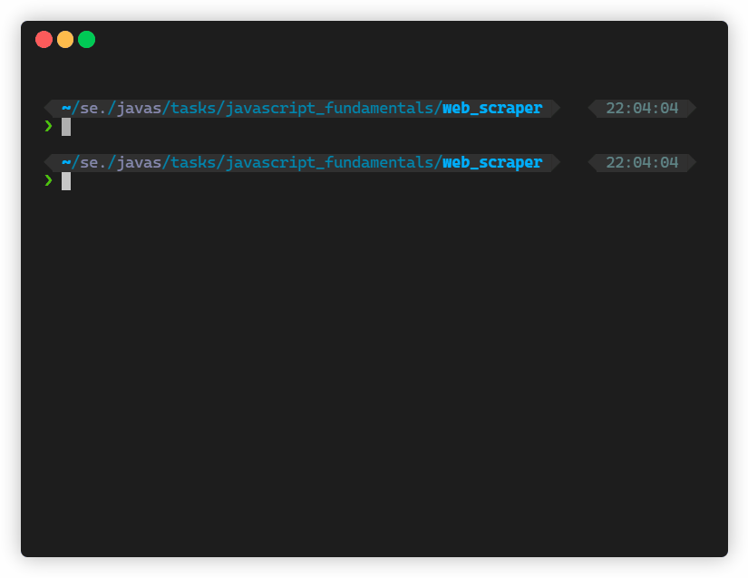

# :tophat: Web Scraper With Node

This solution is made by Sebastian Porling and Mehtab Kayani.

## :boom: Execution and compile

You can compile this by using `npm i`. By using `npm run build` you will make executable binaries for all operating systems. But the Windows version seems to be buggy.

And execute by using `npm start` or running any of the binaries which can be found in the **/build** directory. If using linux to run you simply do the following from the root folder: `./build/web_scraper-linux`. But if you for some reason want to use only node to run the application you can do `node bin.js`. You can't run the [**index.js**](./index.js) because it doesn't have anything that executes the main function. This was done just to follow the how they do it in the [**pkg**](https://www.npmjs.com/package/pkg) package. They do this just to seperate all the compile and deploy logic away from the main files.

Here is a sample execution generated with [terminalizer](https://terminalizer.com/):



## :question: Motivation

We decided to gather information from [presidents of the United States of America!](https://en.wikipedia.org/wiki/List_of_presidents_of_the_United_States)
The structure we were looking for is like this:

```json
[
    {
        "number" "integer"
        "name": "string",
        "img": "string",
        "link": "string",
        "party": "string",
        "born": "date",
        "died": "date",
        "signature": "string"
    }
]
```

We decided to use [**cheerio**](https://www.npmjs.com/package/cheerio) in order to scrape the page. It used simple and understandable syntax that is basically identical to jQuery. All the web scraping is done in the class [**webScraper.js**](./modules/webScraper.js). It exports the methods used for scraping the list of USA presidents and each president.

We use the [**axios**](https://www.npmjs.com/package/axios) package to fetch the data from wikipedia! The first request is pretty fast, but it takes some time to fetch infromation on each wikipedia page for the presidents. We only gather the birth and death dates from the presidents own wikipage. The rest of the info could be gathered from the list of presidents page.

The class [**fileWriter.js**](./modules/fileWriter.js) utilizes the [**jsonfile**](https://www.npmjs.com/package/jsonfile) package. It writes a json file with the given path/filename and json input.

The main class [**index.js**](./index.js) uses a "throbber" for the console output, showing that something is happening for the user. Because fetching all the presidents take some time. This is done by using the package [**ora**](https://www.npmjs.com/package/ora) which makes you able to make a "throbber" with different styling. Here is how an example throbber could look like:


We do validation on the data that comes from the wiki page with the list of presidents and the data that comes from a president page by utilizing the [**validate.js**](https://www.npmjs.com/package/validate.js) package. In the class [**validator.js**](./modules/validator.js) we have the methods used for validating the json data. It uses the constraints found in [**constraints.js**](./modules/constraints.js), which is basically a form of json schema. We check so the fields are of the right type and matches some regex.

Something interesting to know about the implementation of the fetching of each president is that using this version of a loop (removed logging and error handling in the example):

```javascript
await Promise.all(presidents.map(async (president) => {
    const response = await getPresident(president.link);
    const presidentInfo = await scrapePresident(response.data);
    result.push(await Object.assign(president, presidentInfo));
}));
```

Is much faster than trying to do it synchrounously. We timed it to be about 40% faster to use the asyncrounous version with the map function. As each iteration takes some time it has a it will be gathered in the `Promise.all()`. When all iterations are done we can return the resulting json array. This does though make the throbber "lag" a litte, but still much faster then doing all the requests synchrounously. We have to sort all the presidents afterwards as the fetches might return in different orders.

We made the class [**timer.js**](./modules/timer.js) to measure the exucution time of the program. It can also be used for measuring each function or specific parts of the application.

Lastly there is the [**welcomeMessage.js**](./modules/welcomeMessage.js) that just displays a pleasing welcome message to the user. It utilizes the [**figlet**](https://www.npmjs.com/package/figlet) package which makes an ASCII art/text out of the normal text you give it. It is possible to use different art/text styles and fonts. We just use the standard config.
